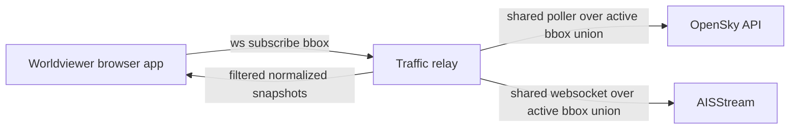

# Live Traffic Overlays

## Context

Worldviewer is a browser-based Earth viewer built on MapLibre GL JS. Arthur wants to add live aircraft and ship overlays for personal, non-commercial use.

The design should stay small. We do not need migration support, rollback support, compatibility with the old behaviour, or a general-purpose streaming platform.

## What Matters

- The map must stay responsive in a normal browser.
- Setup must stay simple.
- Secrets must stay off the public internet.
- The code should fit the current app, not fight it.

## Scope

Add two optional live overlays:

- Aircraft positions from OpenSky.
- Ship positions from AISStream.

The overlays should update in near real time, follow the current viewport, and be easy to turn on and off in the UI.

## Non-Goals

- Historical replay
- Global full-density tracking at all times
- Commercial-grade uptime or coverage
- Multi-user scale optimisation
- Persistent storage
- Replay, audit, or analytics pipelines

## Decision Summary

Use a tiny local/backend relay process and keep the browser simple.

Why:

- AISStream explicitly does not support browser-direct connections. Their docs say the expected pattern is backend consumption plus client relay.
- OpenSky can be polled by bounding box and anonymous access should not be queried more often than every 10 seconds.
- MapLibre can already handle live GeoJSON updates cleanly through `GeoJSONSource.setData()`.
- One shared upstream session per provider is safer than one upstream session per browser tab.

## Proposed Design

### 1. Components

- Existing Vite + MapLibre frontend
- New small Node + TypeScript traffic relay
- External feeds:
  - OpenSky for aircraft
  - AISStream for ships

No database. No queue. No cache beyond in-memory last-known positions.

### 2. High-Level Flow



### 3. Browser to Relay Contract

Use one websocket between browser and relay.

Internally, the relay and browser use one canonical bounding box format:

- `[west, south, east, north]`
- longitude first, then latitude
- WGS84 decimal degrees

Provider adapters are responsible for converting this into whatever each upstream service expects.

Examples:

- OpenSky adapter maps to `lamin`, `lomin`, `lamax`, `lomax`.
- AISStream adapter maps to `BoundingBoxes` corner pairs and sets explicit message filters.

Browser sends:

```json
{
  "type": "subscribe",
  "bbox": [-3.6, 55.8, -3.0, 56.1],
  "zoom": 9.4,
  "layers": {
    "aircraft": true,
    "ships": true
  }
}
```

Relay sends:

```json
{
  "type": "snapshot",
  "aircraft": [],
  "ships": [],
  "serverTime": 1773264000000,
  "status": {
    "aircraft": { "code": "ok", "message": null },
    "ships": { "code": "ok", "message": null }
  }
}
```

Keep the protocol boring. One subscription shape and one snapshot shape are enough for the first version.
The `status` block lets the relay tell the browser when a layer is unavailable or the user needs to zoom in.

## Relay Design

### 1. Shared Upstream Sessions

Use one shared upstream feed per provider inside the relay:

- one shared OpenSky polling loop
- one shared AISStream websocket

The relay keeps the set of active client subscriptions, computes one union bbox per provider, pulls the upstream data once, and then filters the normalized tracks back down per client.

This is still small enough for a personal app, but it avoids multiplying upstream traffic when Arthur opens more than one tab.

If the union bbox becomes too large, the relay should refuse the subscription and tell the client to zoom in.

### 2. Aircraft Behaviour

- Poll OpenSky for the latest state vectors within the active aircraft bbox union.
- Poll every 15 seconds by default.
- Do not poll faster than every 10 seconds.
- Treat aircraft data as snapshot-based. Replace the aircraft set on each poll.
- Filter the shared aircraft snapshot back down to each client bbox before sending it.

### 3. Ship Behaviour

- Keep one shared AISStream websocket open in the relay.
- Subscribe using the active ship bbox union.
- On bbox change, send an updated AISStream subscription on the existing websocket instead of reconnecting unless the socket is already broken.
- Subscribe to both `PositionReport` and `ShipStaticData`.
- Keep an in-memory map of latest ship positions keyed by MMSI.
- Keep a second small in-memory map for latest static vessel details keyed by MMSI.
- Expire stale ships after a short timeout, for example 5 minutes.
- Filter the shared ship set back down to each client bbox before sending it.

### 4. Normalized Track Shape

Use one shared shape in the relay and frontend:

```ts
type LiveTrackKind = "aircraft" | "ship";

type LiveTrack = {
  id: string;
  kind: LiveTrackKind;
  lng: number;
  lat: number;
  heading: number | null;
  speedKnots: number | null;
  altitudeMeters: number | null;
  label: string | null;
  source: "opensky" | "aisstream";
  updatedAt: number;
};
```

Notes:

- `id` is `icao24` for aircraft and `mmsi` for ships.
- `altitudeMeters` is usually null for ships.
- `label` can be null at first for ships until `ShipStaticData` arrives.
- Keep the shared model small. Do not build a giant transport schema.

## Frontend Design

### 1. Data Sources

Add two GeoJSON sources:

- `live-aircraft`
- `live-ships`

The browser stores the latest normalized tracks and pushes them into MapLibre with `setData()`.

Do not implement a delta protocol in the first pass. Full snapshots are simpler and good enough for the expected data volume in a personal app.

### 2. Layers

Add these layers:

- aircraft symbol layer
- ship symbol layer
- optional cluster layers for low zoom

Do not add trails in the first pass. Trails add more data churn and visual noise than value here.

### 3. Styling

- Aircraft icon rotates by heading.
- Ship icon rotates by heading or course over ground if available.
- Use different colours for aircraft and ships.
- Fade stale points by lowering opacity before removal.
- Show a small popup with label, speed, altitude, and last update time.
- If ship static data has not arrived yet, show MMSI instead of a name.

### 4. Viewport Rules

- Send bbox updates on `moveend`, not every `move`.
- Debounce bbox updates, for example 300 ms.
- Suppress live requests automatically below a very low zoomed-out threshold if density becomes silly, while keeping the toggles on and showing a plain-English hint.

This keeps the browser budget under control.

## UI Changes

Add a small `Live Traffic` section to the existing control dock:

- `Aircraft` toggle
- `Ships` toggle
- `Live` status text

No feature flags. If ships are unavailable because the server has no AIS key, show the toggle disabled with a clear label.

Also show a small plain-English note that live coverage varies by region and source.

## Configuration

Keep configuration minimal:

- `AISSTREAM_API_KEY`: required only for ships

That is enough for the first version.

OpenSky should use anonymous access first. Do not add OpenSky credentials unless Arthur actually needs them later.

Use fixed local defaults in code for everything else:

- relay port
- poll interval
- stale timeout

## Local Runtime

Keep local development simple:

- Run the relay as a second local process on a fixed port, for example `3210`.
- Expose one websocket endpoint such as `/traffic`.
- In Vite development, proxy `/traffic` to the relay.

Do not add a process manager or multi-service orchestration layer. Two terminals are fine in this repo.

## Attribution And Terms

- Add OpenSky and AISStream to the map credits when their layers are enabled.
- Keep the wording clear that the traffic overlays are for personal, non-commercial use.
- Note in the UI or README that traffic coverage and freshness depend on public community feeds.

## Failure Behaviour

- If OpenSky fails, keep the last aircraft snapshot briefly and mark it stale.
- If AISStream disconnects, retry with a short backoff.
- If the relay is unavailable, the map still loads and only the traffic section shows an error.

The Earth viewer must remain usable without live traffic.

## File Layout

Proposed new files:

```text
server/
  trafficRelay.ts
  providers/
    opensky.ts
    aisstream.ts
  trafficModel.ts

src/
  traffic/
    trafficClient.ts
    trafficSource.ts
    trafficLayers.ts
    trafficTypes.ts
```

This keeps provider code out of `src/main.ts` and avoids turning the existing file into a junk drawer.

## Implementation Slices

### Slice 1

- Add the relay process
- Add browser websocket connection
- Add aircraft only

### Slice 2

- Add AISStream ship relay
- Add ship layer and popups

### Slice 3

- Add clustering and stale-state polish

This order gives value early and keeps debugging tight.

## Risks

- Coverage and freshness depend on public community feeds.
- AISStream coverage is uneven and strongest near coastlines and receiver networks.
- AISStream is still evolving, so message details may shift.
- AISStream requires a backend secret and could throttle abusive usage.
- OpenSky anonymous access is rate-limited and should stay conservative.
- Provider bbox formats differ, so the adapter boundary must stay explicit.
- The current frontend bundle is already large, so new code should stay light and avoid extra heavy mapping libraries.

## Recommendation

Proceed with the relay-based design.

It is the smallest design that:

- keeps secrets off the client
- fits the current app
- respects the public feed constraints
- avoids overengineering

## Sources

- [OpenSky API docs](https://openskynetwork.github.io/opensky-api/)
- [OpenSky REST docs](https://openskynetwork.github.io/opensky-api/rest.html?source=post_page-----48903d686976---------------------------------------)
- [AISStream documentation](https://aisstream.io/documentation)
- [AISStream coverage](https://aisstream.io/coverage)
- [MapLibre GeoJSONSource docs](https://maplibre.org/maplibre-gl-js/docs/API/classes/GeoJSONSource/)
